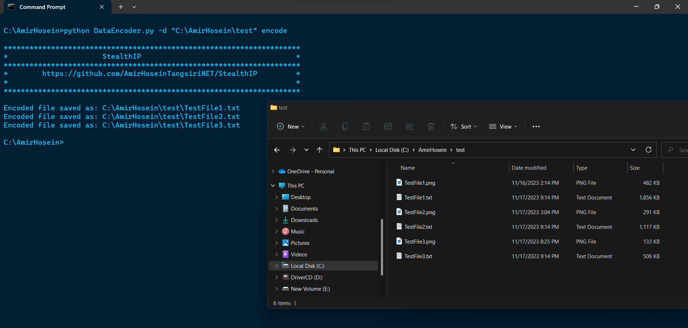

# StealthIP
This Code Allows You Tto Encode/Decode files In a the IP format for steganography.
In the encoding process, you can either encode a single file or encode all files in a directory. The file(s) are read as binary data and divided into segments of 4 bytes. Each segment is then converted into a string representation of an IP address and joined together with line breaks to create the encoded data. The encoded data is then saved in a file named based on your data file name.

  

In the decoding process, you can either decode a single file or decode all files ending with “.txt” in a directory. The encoded data is read from the input file, which should be in plaintext. Each line of the encoded data is split into individual segments, and each segment is converted back into bytes. The decoded bytes are then saved to a file with a specified output format or the original file format if not provided.

## Usage
To use the code, you can run the script with the following command line arguments:

### Encoding Data:
- python script.py encode -f input_file_path
OR
- python script.py encode -d input_directory_path

### Decoding Data:
- python script.py decode -f input_file_path --output_format output_file_format
OR
- python script.py decode -d input_directory_path --output_format output_file_format

Note: In both cases, you need to specify the mode (encode or decode) and the input file or directory. For decoding, you also need to specify the output file format.
Disclaimer: This script is provided as-is without any warranty. The author takes no responsibility for the misuse or consequences of its usage.
